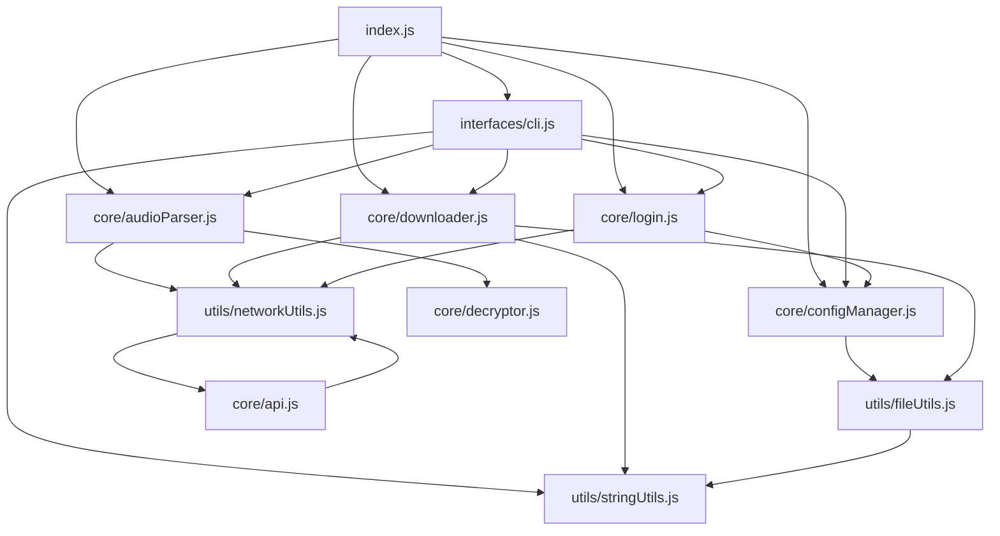
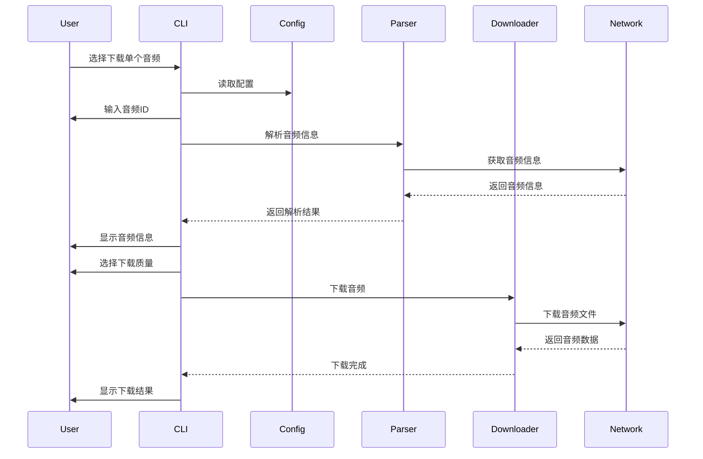
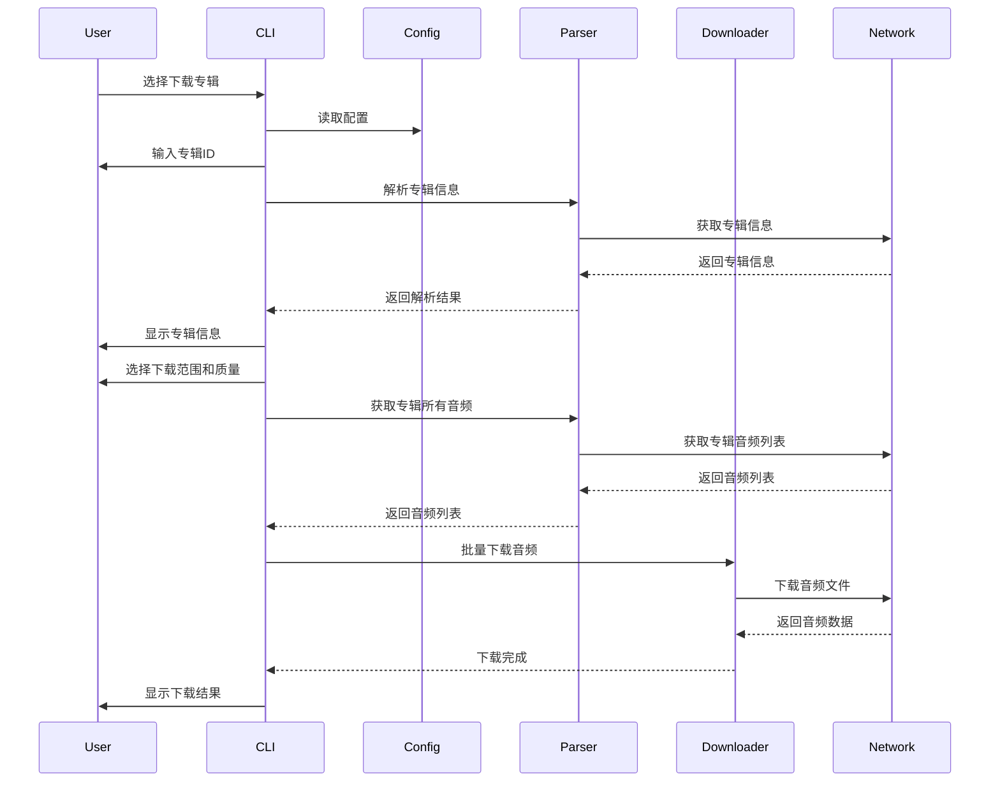
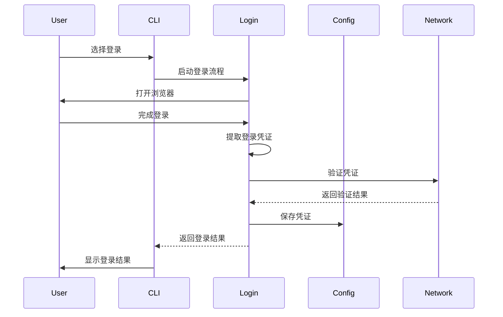

# 喜马拉雅下载器架构文档

本文档详细描述了喜马拉雅下载器的模块化架构、各模块的功能和依赖关系。

## 项目结构

```
ximalaya-downloader/
├── core/                   # 核心模块目录
│   ├── api.js              # API请求模块
│   ├── audioParser.js      # 音频解析模块
│   ├── configManager.js    # 配置管理模块
│   ├── decryptor.js        # 解密模块
│   ├── downloader.js       # 下载模块
│   └── login.js            # 登录模块
├── utils/                  # 工具模块目录
│   ├── fileUtils.js        # 文件操作工具
│   ├── networkUtils.js     # 网络请求工具
│   └── stringUtils.js      # 字符串处理工具
├── interfaces/             # 接口模块目录
│   └── cli.js              # 命令行接口
├── tests/                  # 测试目录
├── docs/                   # 文档目录
├── index.js                # 主入口文件
├── package.json            # 项目配置
└── README.md               # 项目说明
```

## 模块说明

### 核心模块 (core/)

#### api.js - API请求模块
负责与喜马拉雅API交互，获取音频和专辑信息。

**主要功能：**
- 获取音频信息
- 获取专辑信息
- 获取用户信息
- 检查音频是否可下载
- 获取音频下载链接

**依赖关系：**
- 依赖 `utils/networkUtils.js` 进行HTTP请求

#### audioParser.js - 音频解析模块
解析喜马拉雅音频信息，处理免费和VIP音频。

**主要功能：**
- 解析单个音频信息
- 解析专辑信息
- 获取专辑所有音频
- 判断专辑类型（免费、已购买、VIP）
- 检查音频是否可下载

**依赖关系：**
- 依赖 `utils/networkUtils.js` 进行网络请求
- 依赖 `core/decryptor.js` 进行VIP音频解密

#### configManager.js - 配置管理模块
管理用户配置，包括登录凭证、下载路径等。

**主要功能：**
- 读取配置
- 写入配置
- 更新配置
- 验证配置

**依赖关系：**
- 依赖 `utils/fileUtils.js` 进行文件操作

#### decryptor.js - 解密模块
处理VIP音频的解密功能。

**主要功能：**
- 解密VIP音频URL
- 批量解密URL
- 检查URL是否加密

**依赖关系：**
- 无外部依赖

#### downloader.js - 下载模块
处理音频文件下载，支持单个和批量下载。

**主要功能：**
- 下载单个音频
- 下载多个音频
- 下载整个专辑
- 重试失败的下载

**依赖关系：**
- 依赖 `utils/networkUtils.js` 进行网络请求
- 依赖 `utils/fileUtils.js` 进行文件操作
- 依赖 `utils/stringUtils.js` 进行字符串处理

#### login.js - 登录模块
处理用户登录流程，包括浏览器自动化和凭证提取。

**主要功能：**
- 执行登录流程
- 启动浏览器
- 等待用户登录
- 提取登录凭证
- 验证凭证

**依赖关系：**
- 依赖 `core/configManager.js` 保存登录凭证
- 依赖 `utils/networkUtils.js` 进行网络请求

### 工具模块 (utils/)

#### fileUtils.js - 文件操作工具
提供文件和目录操作的工具函数。

**主要功能：**
- 检查文件是否存在
- 创建目录
- 获取文件大小
- 生成安全的文件名
- 下载文件

**依赖关系：**
- 依赖 `utils/stringUtils.js` 进行字符串处理

#### networkUtils.js - 网络请求工具
提供HTTP请求的工具函数，包括重试机制和错误处理。

**主要功能：**
- 发送HTTP请求
- 创建认证头
- 生成xm-sign
- 检查网络状态
- 获取响应时间

**依赖关系：**
- 无外部依赖

#### stringUtils.js - 字符串处理工具
提供字符串处理相关的工具函数。

**主要功能：**
- 替换文件名中的非法字符
- 格式化时间
- 格式化文件大小
- 生成随机字符串
- 截断字符串

**依赖关系：**
- 无外部依赖

### 接口模块 (interfaces/)

#### cli.js - 命令行接口
处理用户输入、显示菜单和调用核心模块的功能。

**主要功能：**
- 显示主菜单
- 处理用户选择
- 调用核心模块功能

**依赖关系：**
- 依赖 `core/configManager.js` 读取和更新配置
- 依赖 `core/audioParser.js` 解析音频和专辑
- 依赖 `core/downloader.js` 下载音频
- 依赖 `core/login.js` 处理登录
- 依赖 `utils/stringUtils.js` 格式化显示

## 模块依赖关系图



## 接口调用流程图

### 下载单个音频流程



### 下载专辑流程



### 登录流程



## 按需加载机制

本项目采用ES6模块规范，实现了按需加载机制，主要特点如下：

1. **动态导入**：使用`import()`语法动态加载模块，而不是在文件顶部静态导入所有模块。

2. **延迟加载**：只有在需要特定功能时才加载对应的模块，减少初始加载时间和内存占用。

3. **模块隔离**：每个模块都是独立的，通过明确的导入/导出接口进行交互，避免全局变量污染。

4. **循环依赖解决**：通过合理的模块设计避免了循环依赖问题，确保模块加载顺序正确。

### 按需加载实现示例

在`index.js`中，我们使用动态导入来实现按需加载：

```javascript
// 下载单个音频
export async function downloadSound(soundId, options = {}) {
  // 动态导入所需模块
  const { analyzeSound } = await import('./core/audioParser.js');
  const { downloadSound } = await import('./core/downloader.js');
  
  // 使用导入的模块执行操作
  const soundInfo = await analyzeSound(soundId);
  return await downloadSound(soundInfo, options);
}
```

## 配置管理

配置文件位于 `config.json`，包含以下选项：

- `cookie`: 登录凭证
- `path`: 下载路径
- `bid`: 用户ID
- `quality`: 默认下载质量
- `maxRetries`: 最大重试次数
- `concurrentDownloads`: 并发下载数
- `userAgent`: 用户代理

配置管理模块提供了完整的配置操作接口，包括读取、写入、更新和验证配置。

## 错误处理

本项目采用分层错误处理策略：

1. **工具层**：处理底层错误，如网络请求失败、文件操作错误等。
2. **核心层**：处理业务逻辑错误，如音频解析失败、解密失败等。
3. **接口层**：处理用户交互错误，如输入验证、操作取消等。

每个模块都定义了明确的错误类型和处理机制，确保错误能够被正确捕获和处理。

## 性能优化

1. **并发下载**：支持并发下载多个音频文件，提高下载效率。
2. **重试机制**：自动重试失败的下载，提高下载成功率。
3. **缓存机制**：缓存API响应数据，减少重复请求。
4. **按需加载**：只加载必要的模块，减少内存占用。

## 安全考虑

1. **凭证安全**：登录凭证存储在本地配置文件中，不上传到服务器。
2. **输入验证**：对所有用户输入进行验证，防止注入攻击。
3. **文件名安全**：自动清理文件名中的非法字符，防止文件系统错误。
4. **网络安全**：使用HTTPS进行所有网络请求，确保数据传输安全。